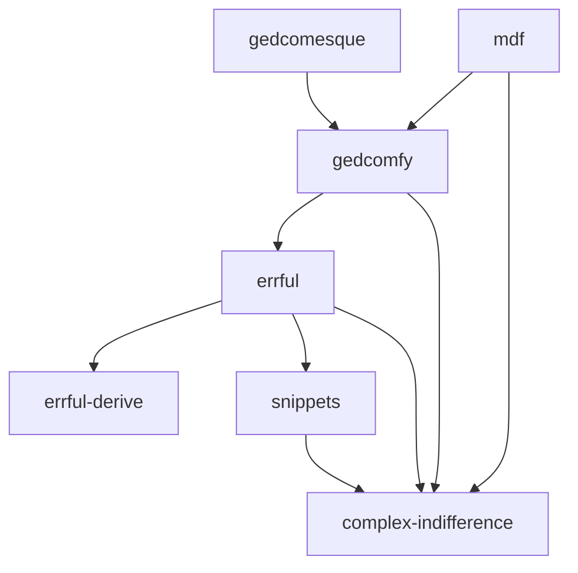

This is a GEDCOM parser that got out of hand.

The various crates are:

- `mdf`: the top-level tool for dealing with GEDCOM files
- `gedcomfy`: the GEDCOM parser & schemas itself
- `gedcomesque`: SQL types for GEDCOM
- [`errful`](./errful/README.md): supplementary information for errors (like `miette`) and rendering
- `errful-derive`: derive proc-macro for `errful`	
- `snippets`: rendering source code with labels attached
- `complex-indifference`: typed numeric types

### Dependency Graph

