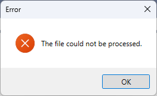

# Validation Comparions: Large files

> For information about these comparisons, see the [main comparison page](../comparison.md).

This page contains comparisons of `gedcomfy` against other tools on large GEDCOM files. These files are not realistic in any way (they do not represent real genealogical data), but they are useful for testing the performance of the tools.

Note that at the moment, both of these files seem to have been created in such a way that `gedcomfy` will immediately reject them. Once it has a “quirks mode” to enable parsing, it will be interesting to see how it compares to other tools.

## `ITIS.ged` (93,468 KB, modification date 2008-05-02) |

### gedcomfy

At first it only discovers the first encoding error, and stops processing in under a second:

```
Error: gedcom::encoding::invalid_data

  × validating .\private\ITIS.ged
  ├─▶ Encoding error detected: further validation errors will not be found
  ├─▶ GEDCOM file contained data which was invalid in the detected encoding
  ├─▶ Invalid data for encoding ASCII
  ╰─▶ the byte at index 61622248 is not ASCII
         ╭─[.\private\ITIS.ged:3265646:10]
 3265645 │ 0 @I624736@ INDI
 3265646 │ 1 NAME Mj�bergi/Animalia/
         ·          ┬
         ·          ╰── this is not valid data for the encoding ASCII
 3265647 │ 2 GIVN Mj�bergi
         ╰────

Advice: gedcom::encoding_reason::header

  ☞ this encoding was specified in the GEDCOM header
    ╭─[.\private\ITIS.ged:17:8]
 16 │ 2 Form LINEAGE - LINKED
 17 │ 1 CHAR ASCII
    ·        ──┬──
    ·          ╰── encoding was specified here
 18 │ 1 LANG English
    ╰────

Advice: gedcom::possible_encodings

  ☞ the invalid data appears to be valid in another encoding:
  │ → Mjöbergi (using Windows-1252)
  help: encoding can be chosen explicitly using the `--force-encoding` option
```

If we supply `--force-encoding windows-1252`:

```
INFO mdf: file is (syntactically) valid record_count=5066522 elapsed=455.9538ms path=.\private\ITIS.ged
```

### GEDCOM Validator

Fails after approximately 1m 30s, during “Checking tags”, with the following error:



### GED-inline

Successfully validates the file in 146 seconds (144 spent in analysis, by its own count).

It discovers 7 syntax errors, and many pointer reference issues.

```
Generated by                   PAF
Submitted by                   Paul Pruitt
Encoding                       ASCII
GEDCOM version in file         5.5
GEDCOM version assumed         5.5

Analysis time                  144 seconds to analyse the file (excluding upload time)
Speed                          3717 records per second

Lines                 5066522  Number of lines in the GEDCOM file
Records                538478  Number of records
Warnings               406884  Total number of warning messages
User-defined                0  Number of lines with user-defined tags

Individuals            472676  Number of individuals in the GEDCOM file
Males                  472676  Number of males
Females                     0  Number of females
Other                       0  

Families                65799  Number of families
Marriages                   0  Number of marriages
Places                      0  Number of places mentioned (not necessarily unique)
Source records              0  Number of source records

Can't find pointer reference @F100000@ in file
[ SKIPPED SOME ~FOUR HUNDRED AND SIX THOUSAND LINES ]
Can't find pointer reference @F99@ in file

*** Line 14:      Mandatory tag FORM not found under GEDC
*** Line 16:      Tag Form is not allowed under GEDC
*** Line 3265646: Line contains illegal character(s)
*** Line 3265647: Line contains illegal character(s)
*** Line 3286276: Line contains illegal character(s)
*** Line 3286277: Line contains illegal character(s)
*** Line 3292456: Line contains illegal character(s)
```

## `CoL2010.ged` (650,134 KB, modification date 2011-10-30)

### gedcomfy

Only discovers the first encoding error, and stops processing in under a second:

```
Error: gedcom::encoding::invalid_data

  × validating .\private\CoL2010.ged
  ├─▶ Encoding error detected: further validation errors will not be found
  ├─▶ GEDCOM file contained data which was invalid in the detected encoding
  ├─▶ Invalid data for encoding ASCII
  ╰─▶ the byte at index 530214 is not ASCII
       ╭─[.\private\CoL2010.ged:23896:25]
 23895 │ 0 @I2171@ INDI
 23896 │ 1 NAME Botryocladia mono�ca Botryocladia//
       ·                         ┬
       ·                         ╰── this is not valid data for the encoding ASCII
 23897 │ 2 GIVN Botryocladia mono�ca Botryocladia
       ╰────

Advice: gedcom::encoding_reason::header

  ☞ this encoding was specified in the GEDCOM header
    ╭─[.\private\CoL2010.ged:17:8]
 16 │ 2 Form LINEAGE - LINKED
 17 │ 1 CHAR ASCII
    ·        ──┬──
    ·          ╰── encoding was specified here
 18 │ 1 LANG English
    ╰────
```

### GEDCOM Validator

Fails immediately, with the following error:


### GED-inline

Successfully validates the file in approximately 13 minutes 33 seconds (810 seconds in analysis):

```
Generated by                   PAF
Submitted by                   Paul Pruitt
Encoding                       ASCII
GEDCOM version in file         5.5
GEDCOM version assumed         5.5

Analysis time                  810 seconds to analyse the file (excluding upload time)
Speed                          3299 records per second

Lines                 29345266  Number of lines in the GEDCOM file
Records               2674484  Number of records
Warnings              2174810  Total number of warning messages
User-defined                0  Number of lines with user-defined tags

Individuals           2424614  Number of individuals in the GEDCOM file
Males                 2424614  Number of males
Females                     0  Number of females
Other                       0  

Families               249867  Number of families
Marriages                   0  Number of marriages
Places                      0  Number of places mentioned (not necessarily unique)
Source records              0  Number of source records

                  Can't find pointer reference @F1000007@ in file
[ MANY INSTANCES REMOVED ]
                  Can't find pointer reference @I2248119@ in file
                  Missing FAMS tag for individual @I2242694@
                  Missing FAMS tag for individual @I2242856@
                  Missing FAMS tag for individual @I2242861@
                  Missing FAMS tag for individual @I2244079@
                  Missing FAMS tag for individual @I2245491@
                  Missing FAMS tag for individual @I2245738@
                  Missing FAMS tag for individual @I2246122@
                  Missing FAMS tag for individual @I2248119@
*** Line 13:      Invalid content for FILE tag: 'C:\Users\socrtwo\Desktop\Catalogue-of-Life-Converter-1.0F\Catalogue-of-Life-Converter-1.0\CoL2010.ged' is more than 90 characters, the maximum length for <FILE_NAME>
*** Line 14:      Mandatory tag FORM not found under GEDC
*** Line 16:      Tag Form is not allowed under GEDC
*** Line 28:      Invalid content for SURN tag: '' missing value for <NAME_PIECE_SURNAME>
*** Line 39:      Invalid content for SURN tag: '' missing value for <NAME_PIECE_SURNAME>
*** Line 50:      Invalid content for SURN tag: '' missing value for <NAME_PIECE_SURNAME>
*** Line 61:      Invalid content for SURN tag: '' missing value for <NAME_PIECE_SURNAME>
*** Line 72:      Invalid content for SURN tag: '' missing value for <NAME_PIECE_SURNAME>
*** Line 23896:   Line contains illegal character(s)
*** Line 23897:   Line contains illegal character(s)
*** Line 32201:   Line contains illegal character(s)
*** Line 32202:   Line contains illegal character(s)
*** Line 37151:   Line contains illegal character(s)
*** Line 7850199: Invalid GEDCOM record 'dej.1821-79 Apoderus//'
*** Line 7850199: Tag xxxx is not allowed under INDI
*** Line 7850199: Tags must consist of alphanumerics: 'ej.1821-79'
*** Line 7850201: Invalid GEDCOM record 'dej.1821-79 Apoderus'
*** Line 7850201: Tags must consist of alphanumerics: 'ej.1821-79'
*** Line 12045348: Invalid GEDCOM record ' martiniheringi Parnassius//'
*** Line 12045348: Tag artiniheringi is not allowed under INDI
*** Line 12045350: Invalid GEDCOM record ' martiniheringi Parnassius'
*** Line 16152133: Invalid content for NAME tag: 'Dorcadion (Pedestredorcadion) septemlineatum novemlineatum m. dorsobasireductum Dorcadion (Pedestredorcadion) septemlineatum//' is more than 120 characters, the maximum length for <NAME_PERSONAL>
*** Line 16152134: Invalid content for GIVN tag: 'Dorcadion (Pedestredorcadion) septemlineatum novemlineatum m. dorsobasireductum Dorcadion (Pedestredorcadion) septemlineatum' is more than 120 characters, the maximum length for <NAME_PIECE_GIVEN>
*** Line 16152144: Invalid content for NAME tag: 'Dorcadion (Pedestredorcadion) septemlineatum octolineatum m. pseudapiceconjunctum Dorcadion (Pedestredorcadion) septemlineatum//' is more than 120 characters, the maximum length for <NAME_PERSONAL>
*** Line 16152145: Invalid content for GIVN tag: 'Dorcadion (Pedestredorcadion) septemlineatum octolineatum m. pseudapiceconjunctum Dorcadion (Pedestredorcadion) septemlineatum' is more than 120 characters, the maximum length for <NAME_PIECE_GIVEN>
*** Line 16152155: Invalid content for NAME tag: 'Dorcadion (Pedestredorcadion) septemlineatum septemlineatum m. basilineatum Dorcadion (Pedestredorcadion) septemlineatum//' is more than 120 characters, the maximum length for <NAME_PERSONAL>
*** Line 21674947: Invalid content for NAME tag: 'Crataegus curvisepala subsp. curvisepala x laevigata nothovar. angustiloba Crataegus curvisepala subsp. curvisepala x laevigata//' is more than 120 characters, the maximum length for <NAME_PERSONAL>
*** Line 21674948: Invalid content for GIVN tag: 'Crataegus curvisepala subsp. curvisepala x laevigata nothovar. angustiloba Crataegus curvisepala subsp. curvisepala x laevigata' is more than 120 characters, the maximum length for <NAME_PIECE_GIVEN>
*** Line 21674958: Invalid content for NAME tag: 'Crataegus curvisepala subsp. curvisepala x laevigata nothovar. latiloba Crataegus curvisepala subsp. curvisepala x laevigata//' is more than 120 characters, the maximum length for <NAME_PERSONAL>
*** Line 21674959: Invalid content for GIVN tag: 'Crataegus curvisepala subsp. curvisepala x laevigata nothovar. latiloba Crataegus curvisepala subsp. curvisepala x laevigata' is more than 120 characters, the maximum length for <NAME_PIECE_GIVEN>
*** Line 21674969: Invalid content for NAME tag: 'Crataegus curvisepala subsp. curvisepala x laevigata nothovar. naviculiformis Crataegus curvisepala subsp. curvisepala x laevigata//' is more than 120 characters, the maximum length for <NAME_PERSONAL>
*** Line 21674970: Invalid content for GIVN tag: 'Crataegus curvisepala subsp. curvisepala x laevigata nothovar. naviculiformis Crataegus curvisepala subsp. curvisepala x laevigata' is more than 120 characters, the maximum length for <NAME_PIECE_GIVEN>
*** Line 22141985: Invalid content for NAME tag: 'Crataegus x Mespilus Crataegus oxyacantha x Mespilus germanica forma asnieresii Crataegus x Mespilus Crataegus oxyacantha x Mespilus germanica//' is more than 120 characters, the maximum length for <NAME_PERSONAL>
*** Line 22141986: Invalid content for GIVN tag: 'Crataegus x Mespilus Crataegus oxyacantha x Mespilus germanica forma asnieresii Crataegus x Mespilus Crataegus oxyacantha x Mespilus germanica' is more than 120 characters, the maximum length for <NAME_PIECE_GIVEN>
*** Line 22141996: Invalid content for NAME tag: 'Crataegus x Mespilus Crataegus oxyacantha x Mespilus germanica forma dardari Crataegus x Mespilus Crataegus oxyacantha x Mespilus germanica//' is more than 120 characters, the maximum length for <NAME_PERSONAL>
*** Line 22141997: Invalid content for GIVN tag: 'Crataegus x Mespilus Crataegus oxyacantha x Mespilus germanica forma dardari Crataegus x Mespilus Crataegus oxyacantha x Mespilus germanica' is more than 120 characters, the maximum length for <NAME_PIECE_GIVEN>
*** Line 26015438: Invalid GEDCOM record 'bo Lobocheilos//'
*** Line 26015438: Tag o is not allowed under INDI
*** Line 26015440: Invalid GEDCOM record 'bo Lobocheilos'
```
